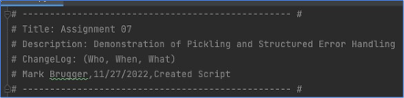
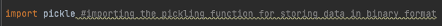
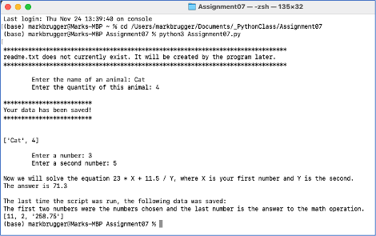

Mark Brugger 
November 30, 2022 
IT FDN 110 A – Foundations of Programming: Python 
Assignment07 
https://github.com/MBrugger11/IntroToProg-Python-Mod07

# DIY Demo Script

## Introduction

This week it was our turn to create a demo script to showcase concepts we learned this week.  It was our first time in a few weeks starting with a blank file rather than some starter code.

## Learning concepts this week

First, we were formally introduced to interfacing with text files in Python.  We were given a few snippets of code early in the class to get a feel for how text file reading/writing worked, but now the concept was expanded in scope.

Previously we used a for loop and a row.split command to access data from a text file.  This week we learned about the readline() function.  As one would expect, it reads one line of data.  By pairing it with an while loop, it is possible to get additional lines out of the file.

The readlines() function (notice the s) reads all the lines at once and returns them as a list.  By contrast, the read() function returns a string.

New this week was reading and writing from binary files instead of the text files.  The function in Python that works with binary files is pickle and this process is called pickling.  It is a topic that we were tasked with researching.  Afternerd, also known as Karim, (see https://www.afternerd.com/blog/python-pickle/) has a webpage that goes into detail on what pickling is and how you can use it in your Python scripts.

The advantage to a binary file versus a text file is it is a more efficient way to store data.  If you are working with a large data set, this will result in storage savings and if the file is being transmitted, it can be more quickly sent.  Since it is not plain text, it keeps casual eyes away, although it is possible for a determined person to extract the data.  So do not think of it is as a security measure.

Structured Error Handling is another item that we scratched the surface with a few weeks ago but now took a deeper look.  Initially we would use a simple try/except loop where we would embed some code inside the try section.  If an error occurred, Python would simply stop executing code in the try section and move down to the except section and run the code there.

It is also possible to catch specific exceptions (e.g. dividing by zero errors, trying to read external files that do not exist, etc.) and write except sections for each one so that the user can get a helpful error message or specific code to help with the situation.  If the specific exceptions do not catch the error, there is a catch-all “except exception” at the end for all other error types.

## Process to make program

This week’s assignment was very open-ended.  We needed to demonstrate working with binary files and error handling.  It was recommended to demo them separately and then have a demo to demo them together.

I started with the typical header:

 
Figure 1 - Script Header

Since we are going to be dealing with binary data, it is necessary to import the pickle function as shown in Figure 2:

 
Figure 2 - Pickle Function

Next, we had the data section of the script (see Figure 3) to initialize variables.  To be honest, this was not used as extensively as it could have been.

 
Figure 3 - Data section of script

The processing section contains two functions.  For the pickling demonstration, it will make use of the read_data_from_file and save_data_to_file functions.  They read and write data respectively to an external binary file.

 
Figure 4 - Processing section with its custom functions

The presentation section of the script is a bit of a misnomer because it not only presents information to the user and seeks input, but also does a few operations.

First, the script showed a simple try/except loop (see Figure 5) for when an external file does exist.

 
Figure 5 - Example of simple try/except error handling

Next, the script asked (shown below in Figure 6) for two pieces of information from the user.  Using pickling, that information was stored in a binary file.

Figure 6 - Simple example of pickling

Finally, the script went through pickling while checking for errors.  The situation was a bit contrived, but by having the script load the binary file at the beginning, it allowed an opportunity for the file not to exist and make use of the except FileNotFoundError section.

 
Figure 7 - Pickling within a try section

The except sections (see Figure 8) looked for two specific types of errors:  the binary file that Python is trying to load not existing, and the script trying to divide by zero due to the choice of number made by the user.  Finally, for an error other than those two, there was a general except exception section at the end to give the user a friendly message and show them what Python found.

 
Figure 8 - Except section for error handling

In Figure 9, we see an example of the script running in the PyCharm IDE.

 
Figure 9 - Output from PyCharm

Finally, Figure 10 shows the script running in the MacOS Terminal.

 
Figure 10 - MacOS Terminal script output sample

The binary file created by the script is shown in Figure 11.  It is not readable by the human eye.

 
Figure 11 - Output of the script in one of the binary files

## Summary

This week we created a demo script from scratch to demonstrate error handling and working with binary files instead of the more typical text file that we had been using.  Both concepts were demonstrated separately and then together as one integrated section of the script.

